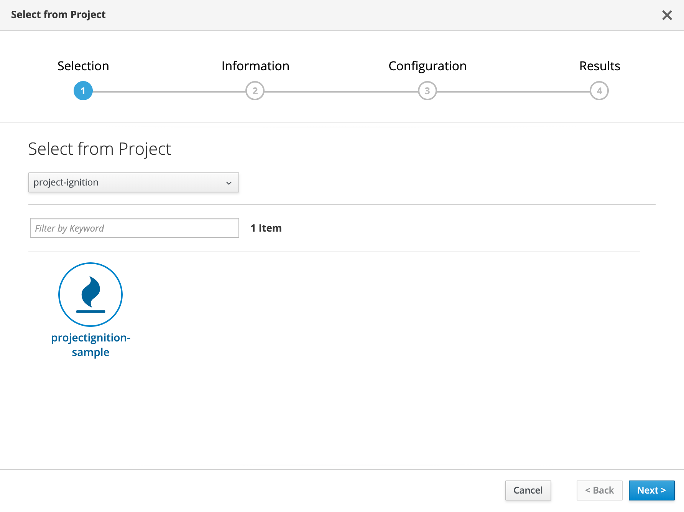
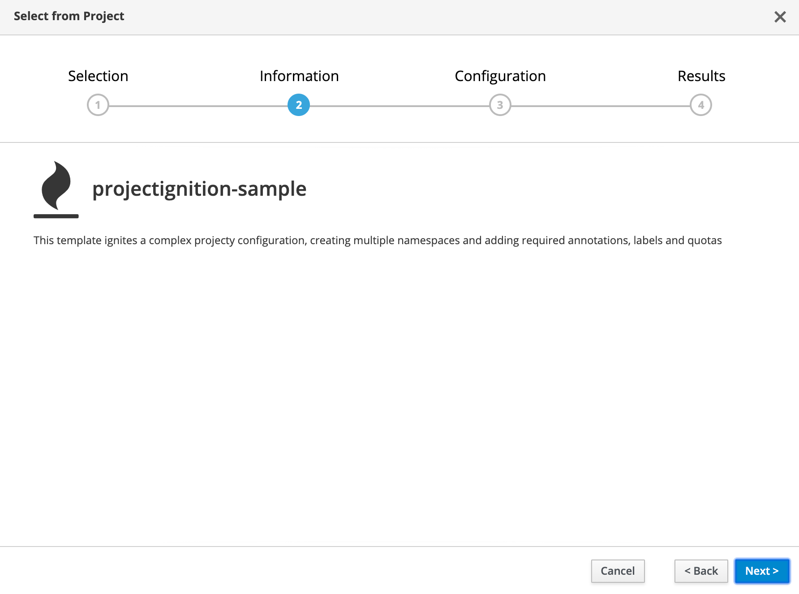
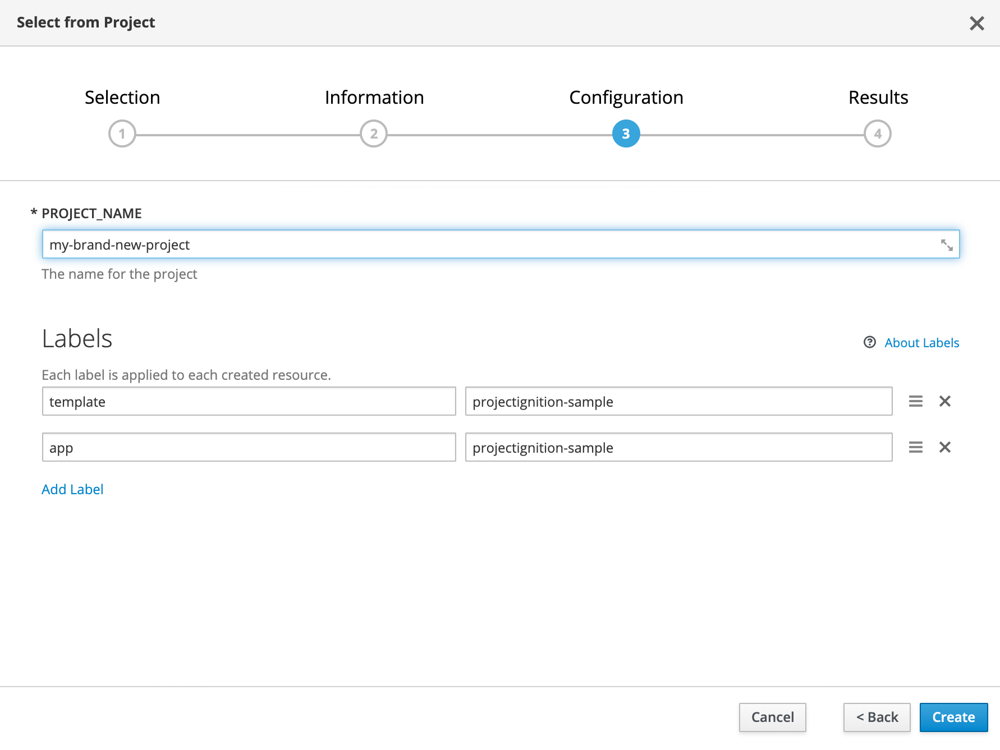

# k8s-project-ignition-operator

Kubernetes Operator to ease complex project (with multiple namespaces) creation. This Operator can be deployed and used on Vanilla Kubernetes or on OpenShift with advanced features.

## What is it?

Doing serious things on Kubernetes and deploying bunch of applications requires discipline and organization to reproduce and repeat the same configuration. Especially when deploying an App requires:
* Defining multiple namespaces for isolating different environments (dev, test, QA, prod),
* Configuring namespaces with adequate annotations and labels,
* Creating the correct role bindings for users, groups and service accounts,
* Applying the different resource quotas per namespace,
* Applying cluster-wide multi namespaces resources quotas on OpenShift,
* ...

This Operator defines and operates a specific `ProjectIgnition` CRD that allows to define different ignition configurations for your different stacks or in-house project methodologies. So that you are able to bootstrap projects with the same set of organisation and configuration of Kubernetes namespaces.

Traditionnaly such automation could be done using Ansible but Operators offer a Kube-native way of doing things!

## Status 

> This is early stage of development and all features described below may not be fully functionnal. If you're interested, please provide feedback as well as feature ideas and Pull Requests 😉


## Define a ProjectIgnition

A `ProjectIgnition` is a custom resource holding description of desired configuration for a set of `Namespaces` hosting a archetypes application. It is defined into the `lbroudoux.github.io/v1beta1` API Group as shown in below header:

```yaml
apiVersion: lbroudoux.github.io/v1beta1
kind: ProjectIgnition
metadata:
  name: example-projectignition
spec:
  projectName: example
  [..]
```

A `ProjectIgnition` specfication then holds definitions for namespaces to ignit:

```yaml
[..]
spec:
  namespaces:
    definitions:
      - name: dev
        [..]
      - name: qa
        [..]
      - name: prod
        [..]
```

A namespace definition allows to specify a name, annotations, labels, roleBindings, finalizers and quotas to apply to a namespace:

```yaml
[..]
spec:
  namespaces:
    definitions:
      - name: dev
        annotations:
          - 'project: {project}'
          - 'github.io/my-annotation: my-annotation-value'
        labels:
          - key: stage
            value: development
        finalizers:
          - custom
        roleBindings:
          - role: edit
            user: system:serviceaccount:fabric:jenkins
          - role: system:image-puller
            group: system:serviceaccounts:{project}-qa
          - role: system:image-puller
            group: system:serviceaccounts:{project}-prod
        quotas:
          - 'https://raw.githubusercontent.com/lbroudoux/k8s-project-ignition-operator/master/samples/quotas/quota-small.yml'
```

Finally, you may have customizations options specific to OpenShift to customize display labels of Namespace or create `ClusterResourceQuota` that applies to all the namespaces of the project.

```yaml
[..]
spec:
  projectName: example
  namespaces:
    useOpenShiftProject: true
    addStageNumber: false
    addStageNameInDisplayName: true
    definitions: [..]
  openShiftMultiProjectQuota:
    projectAnnotationSelector: 'project: {project}'
    projectLabelSelector: null
    quota: 'https://raw.githubusercontent.com/lbroudoux/k8s-project-ignition-operator/master/samples/quotas/cluster-quota.yml'
```

### Placeholders

You may have seen the specific `{project}` string in ignition definition? We currently support 2 placeholders `{project}` and `{namespace}` that will be replaced by correct values by the Operator.

### Full example

Please check [example](https://github.com/lbroudoux/k8s-project-ignition-operator/blob/master/deploy/crds/lbroudoux_v1beta1_projectignition_cr.yaml) CR for full sample of a `ProjectIgnition`.

Once reconciled by the Operator, you should get the following resources created:

```sh
$ kubectl get namespaces | grep example-
example-dev                    Active    45m
example-prod                   Active    45m
example-qa                     Active    45m

$ kubectl get rolebindings -n example-dev
NAME                                                       AGE
edit_system:serviceaccount:fabric:jenkins                  45m
system:deployers                                           45m
system:image-builders                                      45m
system:image-puller_system:serviceaccounts:example-prod    45m
system:image-puller_system:serviceaccounts:example-qa      45m
system:image-pullers                                       45m

$ kubectl get resourcequotas -n example-dev
NAME          CREATED AT
burst-quota   2019-08-09T01:57:59Z
quota         2019-08-09T01:57:59Z

$ kubectl get rolebindings -n example-qa
NAME                                                       AGE
edit_system:serviceaccount:fabric:jenkins                  45m
system:deployers                                           45m
system:image-builders                                      45m
system:image-pullers                                       45m

$ kubectl get resourcequotas -n example-qa
NAME          CREATED AT
burst-quota   2019-08-09T01:57:59Z
quota         2019-08-09T01:57:59Z

$ kubectl get rolebindings -n example-qa
NAME                                                       AGE
edit_system:serviceaccount:fabric:jenkins                  45m
system:deployers                                           45m
system:image-builders                                      45m
system:image-pullers                                       45m

$ kubectl get resourcequotas -n example-qa
NAME          CREATED AT
burst-quota   2019-08-09T01:57:59Z
quota         2019-08-09T01:57:59Z
```

and because it is deployed on OpenShift:

```sh
$ oc get clusterresourcequotas
NAME             LABEL SELECTOR   ANNOTATION SELECTOR
example-quota   <none>           map[project:example]

```


## Deploy the Operator

First thing first, you have to deploy the CRD defining a `ProjectIgnition`, this has to be done cluster-wide.

```sh
$ kubectl create -f deploy/crds/lbroudoux_v1beta1_projectignition_crd.yaml
```

This operator watches a single namespace and thus you should create at least a `Namespace` for hosting the Operator and the future `ProjectIgnition` custom resources.

Then, you can start creating the different service account, roles, role bindings and deployment.

```sh
$ kubectl create -f deploy/service_account.yaml
$ kubectl create -f deploy/role.yaml
$ kubectl create -f deploy/role_binding.yaml
$ kubectl create -f deploy/operator.yaml
```

Wait one minute and check everything is in place:

```sh
$ kubectl oc get pods                                                             
NAME                                        READY     STATUS    RESTARTS   AGE
project-igniter-operator-85bc8fcd8d-4zslk   1/1       Running   0          1h
````

You can now start creating `ProjectIgnition` CRs!


## Make is easily consumable

In order to get your teams easily start with `ProjectIgnitions` you may want to create some [OpenShift templates](https://docs.openshift.com/container-platform/3.11/dev_guide/templates.html) or [Helm charts](https://helm.io) to prepare some stereotypes project ignitions configuratino, letting just the user set up its project name.

As a sample, an OpenShift template is provided [here](https://github.com/lbroudoux/k8s-project-ignition-operator/blob/master/samples/templates/projectignition-openshift-template.yml) and can be deployed alongside the Operator in the same namespace. Requesting a new `ProjectIgnition` is now straightforward from the user point-of-view:



